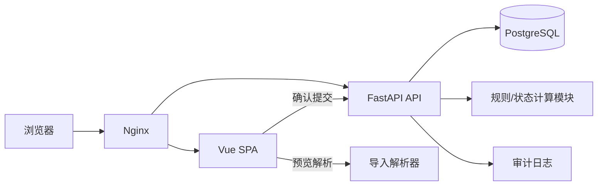
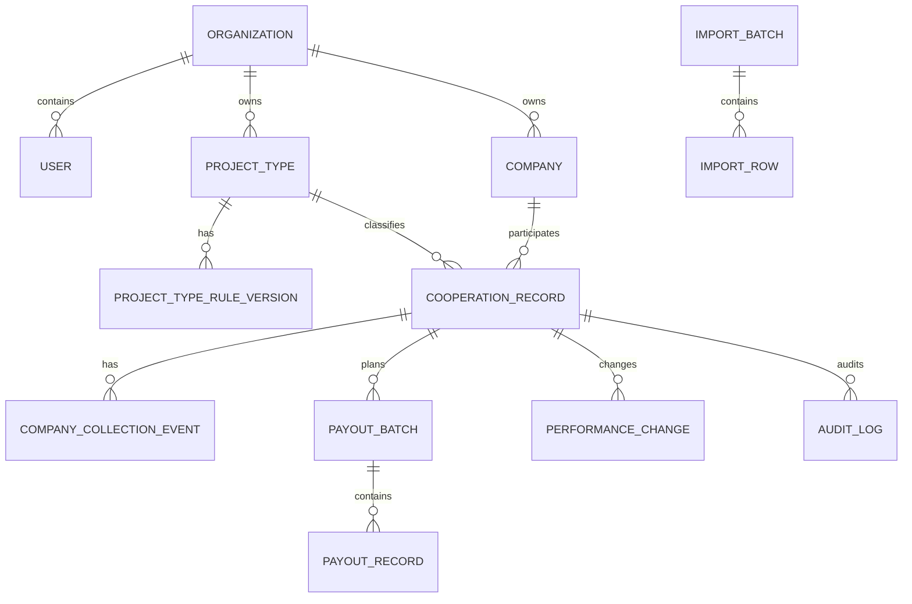

# 个人项目绩效收益记账系统开发方案

版本：V1.0  
对应 PRD：V1.1（历史版本，本仓库未保留该版本 PRD）<br>
开发方式：从零开始的模块化单体 Web 应用  
部署目标：个人私有部署，后续可扩展为多用户/企业版

> 历史参考：本方案早于当前轻量版。当前需求以 [PRD V1.2](../product/PRD.md) 和 [轻量开发方案 V1.2](../development/DEVELOPMENT_PLAN.md) 为准；此文档仅供未来评估企业化扩展时参考。

## 1. 方案结论

推荐采用：

```text
Vue 3 + TypeScript + Vite
            ↓
Nginx / 静态资源服务
            ↓
FastAPI 模块化 API
            ↓
PostgreSQL
```

开发和部署使用 Docker Compose 统一编排：

```text
web     前端构建产物和反向代理
api     FastAPI 应用
db      PostgreSQL
backup  数据备份脚本，不作为常驻服务
```

不采用微服务、消息队列、事件溯源或复杂工作流引擎。当前数据量和用户规模不需要这些基础设施，但后端代码必须按业务模块隔离，不能把所有逻辑堆在路由和页面中。

Vue 官方文档将 Vue 3 定义为组件化、可渐进采用的 Web UI 框架，并提供测试指导；FastAPI 官方文档提供独立部署策略；Docker Compose 适合定义和运行多容器应用；PostgreSQL 事务可以保证导入和业务写入的原子性。[Vue 3 官方指南](https://vuejs.org/guide/introduction)、[Vue 测试指南](https://vuejs.org/guide/scaling-up/testing)、[FastAPI 部署文档](https://fastapi.tiangolo.com/deployment/)、[Docker Compose 文档](https://docs.docker.com/compose/)、[PostgreSQL 事务文档](https://www.postgresql.org/docs/current/tutorial-transactions.html)。

## 2. 架构目标与非目标

### 2.1 架构目标

- 新增一条基础合作记录不超过几步；
- 绩效规则、项目流程和到账记录互不混淆；
- 金额计算可复核、可测试、可追溯；
- Excel/剪贴板导入先预览，再提交；
- 历史规则改变不影响历史合作记录；
- 当前只服务一个用户，但核心表保留 `owner_id` 和 `organization_id` 边界；
- 可以用一台普通服务器或本地 Docker Compose 运行；
- 未来可以增加多人、权限、审批，但不要求第一版重写数据模型。

### 2.2 明确不做

- 不把系统设计成通用项目管理平台；
- 不引入 BPMN 或可视化流程编排器；
- 不引入 AI 作为导入链路的必要依赖；
- 不把公司收款金额当作个人收益金额；
- 不把规则匹配出来的标准绩效自动伪装成实际到账；
- 不使用浮点数直接保存金额；
- 不用数据库触发器承载全部业务规则，核心状态计算必须可以在应用层独立测试。

## 3. 总体架构

### 3.1 运行时架构



导入可以在浏览器完成初步解析和预览，但后端必须重新校验并执行最终写入。前端解析结果不能直接视为可信数据。

### 3.2 后端模块

后端采用模块化单体，每个模块拥有自己的路由、Schema、服务和仓储边界。

```text
apps/api/app/
├── core/                  配置、数据库、认证、异常、日志
├── identity/              用户、组织、当前单用户上下文
├── companies/             合作公司
├── project_types/         项目类型和规则版本
├── cooperation_records/   合作记录和人工覆盖
├── settlement/            里程碑、规则匹配、当前节点计算
├── payouts/               发放批次和个人到账
├── imports/               Excel/CSV/剪贴板导入
├── dashboard/             汇总统计和筛选
└── audit/                 操作日志和历史变化
```

模块之间只通过服务接口或领域对象交互，不直接跨模块修改对方表结构。

### 3.3 前端模块

```text
apps/web/src/
├── app/                   路由、布局、权限、全局错误
├── api/                   API client、请求类型、错误处理
├── features/
│   ├── dashboard/
│   ├── cooperation-records/
│   ├── project-types/
│   ├── payouts/
│   └── imports/
├── components/            表格、金额、状态、时间线等通用组件
├── composables/           查询、筛选、表单和确认逻辑
├── stores/                仅放会话和界面状态
└── styles/                设计令牌和全局样式
```

服务端数据不复制到多个 Pinia store。列表和详情数据以 API 查询结果为准，避免缓存之间互相覆盖。

## 4. 技术栈建议

### 4.1 前端

| 领域 | 建议 | 说明 |
|---|---|---|
| 框架 | Vue 3 | 组件化、适合表单和后台界面 |
| 语言 | TypeScript | 防止金额、状态和导入字段混用 |
| 构建 | Vite | 本地开发和生产构建 |
| 路由 | Vue Router | 页面路由和详情页深链 |
| UI | Element Plus 或同级成熟组件库 | 表格、抽屉、表单、日期选择器 |
| 查询缓存 | TanStack Query for Vue 或统一 composable | 管理 API 查询、刷新和失效 |
| 图表 | ECharts | 年度金额和类型统计，非核心依赖 |
| 导入预览 | `xlsx`/同等表格解析库 | 只做确定性行列解析 |
| 测试 | Vitest、Vue Test Utils、Playwright | 单元、组件、端到端 |

UI 组件库只负责交互外观，不能决定业务状态。状态标签、金额卡片、时间线和导入预览应封装为业务组件。

### 4.2 后端

| 领域 | 建议 | 说明 |
|---|---|---|
| Web API | FastAPI | 类型声明、OpenAPI 和表单 API 适配度高 |
| 语言 | Python 3.12+ | 以项目运行环境实际支持版本为准 |
| Schema | Pydantic | 请求、响应和导入行校验 |
| ORM/数据库访问 | SQLAlchemy 2 | 模块化仓储和事务管理 |
| 驱动 | psycopg | PostgreSQL 连接 |
| 迁移 | Alembic | 数据库版本控制 |
| 测试 | pytest | 领域、API 和数据库测试 |
| 依赖管理 | `pyproject.toml` + uv 或等价工具 | 锁定依赖版本 |

### 4.3 基础设施

- Nginx：同源代理前端和 API，减少 CORS 复杂度；
- PostgreSQL：唯一业务数据库；
- Docker Compose：本地、测试和小型生产环境统一服务编排；
- 备份脚本：`pg_dump` + 定期恢复演练；
- 不引入 Redis、RabbitMQ、对象存储，除非后续功能真正需要。

## 5. 领域模型与数据模型

### 5.1 关键原则

1. **未知使用 `NULL`，不使用 0 代替。** 例如个人比例未知时，不能写成0%。
2. **金额使用整数分。** 数据库保存 `amount_cents BIGINT`，接口也优先使用整数分；前端负责显示为元。
3. **比例使用整数基点。** `10000 = 100%`，`5000 = 50%`，避免浮点误差。
4. **业务日期使用本地日期。** `record_date`、`completion_date` 等使用 `DATE`，默认日期由 `Asia/Shanghai` 计算。
5. **系统时间使用带时区的时间戳。** `created_at`、`updated_at` 存 UTC 或带时区时间，展示统一转换为北京时间。
6. **历史不静默覆盖。** 规则变化、金额人工调整和到账记录都保留操作历史。

### 5.2 表关系



### 5.3 核心表

#### `users`

```text
id UUID PK
email VARCHAR UNIQUE
display_name VARCHAR
password_hash VARCHAR NULL
is_active BOOLEAN
created_at TIMESTAMPTZ
```

第一版只初始化一个用户，不开放注册。

#### `organizations`

```text
id UUID PK
name VARCHAR
created_at TIMESTAMPTZ
```

当前可以只有一个组织，但保留组织边界，便于后续企业化。

#### `organization_memberships`

```text
organization_id UUID
user_id UUID
role VARCHAR
created_at TIMESTAMPTZ
PRIMARY KEY (organization_id, user_id)
```

第一版只使用 owner 角色。

#### `companies`

```text
id UUID PK
organization_id UUID FK
name VARCHAR
normalized_name VARCHAR
status VARCHAR              -- active / archived
created_at TIMESTAMPTZ
updated_at TIMESTAMPTZ
```

`normalized_name` 用于搜索和重复提示，但不作为绝对唯一键，因为现实中可能存在名称相近或名称变更的公司。

#### `project_types`

```text
id UUID PK
organization_id UUID FK
name VARCHAR
normalized_name VARCHAR
status VARCHAR              -- active / archived
created_at TIMESTAMPTZ
updated_at TIMESTAMPTZ
```

#### `project_type_rule_versions`

```text
id UUID PK
project_type_id UUID FK
version_no INTEGER
standard_performance_cents BIGINT
default_ratio_bps INTEGER NULL
publicity_required BOOLEAN NULL
collection_stage VARCHAR     -- none / advance / full / advance_and_full
payout_pattern VARCHAR       -- single / after_advance / advance_then_full / manual
effective_from DATE
effective_to DATE NULL
source_note TEXT NULL
is_active BOOLEAN
created_at TIMESTAMPTZ
```

约束：同一项目类型的 `version_no` 不重复；生效区间不能出现两个同时有效的默认版本，除非用户明确选择覆盖规则。

#### `cooperation_records`

```text
id UUID PK
organization_id UUID FK
owner_id UUID FK
company_id UUID FK
project_type_id UUID FK
rule_version_id UUID FK NULL
record_date DATE
work_status VARCHAR          -- in_progress / completed / cancelled
completion_date DATE NULL
publicity_status VARCHAR     -- not_applicable / pending / published
publicity_date DATE NULL
participation_mode VARCHAR   -- exclusive / shared
my_ratio_bps INTEGER NULL
standard_performance_cents BIGINT NULL
my_due_amount_cents BIGINT NULL
override_standard_cents BIGINT NULL
override_ratio_bps INTEGER NULL
override_publicity_required BOOLEAN NULL
override_collection_stage VARCHAR NULL
override_payout_pattern VARCHAR NULL
override_reason TEXT NULL
archived_at TIMESTAMPTZ NULL
created_at TIMESTAMPTZ
updated_at TIMESTAMPTZ
```

合作记录需要保存规则快照字段，而不能只依赖当前项目类型规则。推荐同时保留 `rule_version_id` 和创建时的标准绩效、流程快照，保证规则版本被停用或修订后历史仍可还原。

不建立 `company_id + project_type_id + record_date` 的唯一约束。重复提示由应用层完成，用户可以明确继续新建。

#### `company_collection_events`

```text
id UUID PK
cooperation_record_id UUID FK
stage VARCHAR                  -- advance / full
occurred_on DATE
note TEXT NULL
created_at TIMESTAMPTZ
```

不保存公司收款金额。预付款和全款是两个业务节点，使用事件表而不是只在合作记录上覆盖两个日期，便于保留历史和未来增加其他节点。

#### `payout_batches`

```text
id UUID PK
cooperation_record_id UUID FK
batch_no INTEGER
name VARCHAR
trigger_type VARCHAR           -- completion / publicity / advance / full / manual
planned_ratio_bps INTEGER NULL
planned_amount_cents BIGINT NULL
status VARCHAR                 -- pending / eligible / partial / completed / unknown
created_at TIMESTAMPTZ
updated_at TIMESTAMPTZ
```

预付款触发的第一批发放可以没有计划比例和计划金额。

#### `payout_records`

```text
id UUID PK
cooperation_record_id UUID FK
payout_batch_id UUID FK NULL
amount_cents BIGINT
received_on DATE
note TEXT NULL
created_at TIMESTAMPTZ
```

每次实际到账都新增记录，不通过覆盖总额实现。

#### `performance_changes`

```text
id UUID PK
cooperation_record_id UUID FK
field_name VARCHAR             -- standard / ratio / due_amount / rule / flow
old_value JSONB NULL
new_value JSONB NULL
reason TEXT
created_at TIMESTAMPTZ
created_by UUID FK
```

#### `cooperation_events`

```text
id UUID PK
cooperation_record_id UUID FK
event_type VARCHAR             -- created / completed / published / advance_received / full_received / payout_added / override
event_date DATE NULL
payload JSONB NULL
created_at TIMESTAMPTZ
created_by UUID FK
```

该表用于详情页时间线和审计，不作为复杂事件溯源系统。当前值仍以业务表为准。

#### `import_batches` 与 `import_rows`

```text
import_batches:
id UUID PK
organization_id UUID FK
source_type VARCHAR            -- xlsx / csv / clipboard
parser_mode VARCHAR
mapping JSONB
status VARCHAR                 -- preview / committed / rolled_back / failed
total_rows INTEGER
valid_rows INTEGER
error_rows INTEGER
created_at TIMESTAMPTZ
committed_at TIMESTAMPTZ NULL

import_rows:
id UUID PK
batch_id UUID FK
row_no INTEGER
raw_values JSONB
normalized_values JSONB
warnings JSONB
errors JSONB
target_record_id UUID NULL
```

## 6. 规则与状态计算

### 6.1 规则匹配优先级

新建或导入合作记录时，按以下顺序匹配项目类型规则：

1. 指定项目类型 + 记录日期命中的有效版本；
2. 若用户手动选择规则版本，使用用户选择；
3. 没有有效规则时，创建记录但将标准绩效和流程标记为待补充；
4. 多个规则都可命中时返回选择项，不自动猜测。

规则匹配结果必须返回：

```text
rule_version_id
standard_performance
default_ratio
publicity_required
collection_stage
payout_pattern
match_source
```

### 6.2 金额计算

```text
effective_standard = override_standard ?? snapshot_standard
effective_ratio = override_ratio ?? my_ratio ?? default_ratio

if effective_due_override exists:
    my_due = effective_due_override
else if effective_standard and effective_ratio are known:
    my_due = round(effective_standard * effective_ratio / 10000)
else:
    my_due = NULL

paid_total = SUM(payout_records.amount_cents)

if my_due is NULL:
    outstanding = NULL
else:
    outstanding = max(my_due - paid_total, 0)
```

计算必须使用整数分，并对四舍五入规则写单元测试。

### 6.3 当前节点计算

实现一个无副作用的纯函数：

```text
calculate_current_node(record, rule_snapshot, collections, payout_batches, payouts)
    -> work_state
    -> publicity_state
    -> collection_state
    -> payout_state
    -> current_node
    -> next_action
```

推荐判断顺序：

1. 已取消：`已取消`；
2. 工作未完成：`进行中`；
3. 需要公示但未公示：`待公示`；
4. 收款节点要求预付款/全款但尚未达到：`待公司收款`；
5. 本人比例或应得金额未知：`待确认个人比例`；
6. 已达到某个发放批次条件但没有实际到账：`待第一批发放` 或 `待尾款发放`；
7. 已到账但低于应得：`部分发放`；
8. 已到账金额大于等于本人应得：`已结清`。

对于 `advance_then_full`：

- 预付款事件存在且第一批没有完成：第一批可发放；
- 第一批已到账但全款事件不存在：显示已部分发放/待全款；
- 全款事件存在且总到账小于本人应得：待尾款发放；
- 总到账达到本人应得：已结清。

状态计算不强制事件录入顺序，支持历史数据补录。

### 6.4 业务写入边界

以下动作使用明确的领域服务，而不是任意 PATCH 状态：

- 标记完成；
- 标记公示；
- 记录预付款；
- 记录全款；
- 新增发放批次；
- 新增个人到账；
- 覆盖绩效或流程规则。

这样可以在一次事务内更新当前快照、写入事件和写入审计日志。

## 7. API 设计

### 7.1 API 约定

- 前缀：`/api/v1`；
- ID：UUID；
- 日期：`YYYY-MM-DD`；
- 时间：ISO 8601；
- 金额：`*_cents` 整数；
- 未知：`null`；
- 列表统一分页；
- 写操作返回更新后的资源摘要和 `current_node`；
- 关键写操作支持 `Idempotency-Key`，避免重复提交到账记录；
- 错误格式统一：

```json
{
  "code": "VALIDATION_ERROR",
  "message": "请求数据校验失败",
  "field_errors": {
    "company_id": ["不能为空"]
  },
  "trace_id": "..."
}
```

### 7.2 认证与当前用户

```text
POST /api/v1/auth/login
POST /api/v1/auth/logout
GET  /api/v1/auth/me
```

第一版不开放注册。首次启动通过环境变量或一次性初始化命令创建单用户。

### 7.3 合作公司

```text
GET  /api/v1/companies
POST /api/v1/companies
PATCH /api/v1/companies/{id}
POST /api/v1/companies/{id}/archive
```

创建合作记录时如果输入了一个新公司名，前端可以先请求公司搜索；是否立即创建新公司由用户确认。

### 7.4 项目类型与规则

```text
GET  /api/v1/project-types
POST /api/v1/project-types
PATCH /api/v1/project-types/{id}
POST /api/v1/project-types/{id}/archive

GET  /api/v1/project-types/{id}/rules
POST /api/v1/project-types/{id}/rules
POST /api/v1/project-types/{id}/rules/{rule_id}/retire
```

创建新规则版本不修改旧版本。规则版本提交时校验生效日期是否冲突。

### 7.5 合作记录

```text
GET  /api/v1/cooperation-records
POST /api/v1/cooperation-records/duplicate-check
POST /api/v1/cooperation-records
GET  /api/v1/cooperation-records/{id}
PATCH /api/v1/cooperation-records/{id}/basic
POST /api/v1/cooperation-records/{id}/complete
POST /api/v1/cooperation-records/{id}/publish
POST /api/v1/cooperation-records/{id}/override
POST /api/v1/cooperation-records/{id}/archive
```

`POST /duplicate-check` 只返回警告，不锁定创建：

```json
{
  "warnings": [
    {
      "type": "POSSIBLE_DUPLICATE",
      "record_id": "...",
      "display_name": "甲公司｜DCMM评估｜2026-03"
    }
  ]
}
```

### 7.6 公司收款节点

```text
POST /api/v1/cooperation-records/{id}/collections/advance
POST /api/v1/cooperation-records/{id}/collections/full
GET  /api/v1/cooperation-records/{id}/collections
DELETE /api/v1/cooperation-records/{id}/collections/{event_id}
```

删除历史节点应优先改为撤销事件或软删除，并写入审计日志，不直接物理删除。

### 7.7 发放批次和个人到账

```text
GET  /api/v1/cooperation-records/{id}/payout-batches
POST /api/v1/cooperation-records/{id}/payout-batches
PATCH /api/v1/payout-batches/{id}

GET  /api/v1/cooperation-records/{id}/payouts
POST /api/v1/cooperation-records/{id}/payouts
PATCH /api/v1/payouts/{id}
POST /api/v1/payouts/{id}/void
```

新增个人到账时校验金额为正数；允许到账金额大于当前应得，但给出警告并记录原因。

### 7.8 Dashboard 和统计

```text
GET /api/v1/dashboard/summary?year=2026&date_basis=record
GET /api/v1/dashboard/attention
GET /api/v1/analytics/by-type
GET /api/v1/analytics/by-company
GET /api/v1/exports/cooperation-records
```

统计时间口径必须明确：`record`、`completion`、`payout` 三种口径不能混用。

### 7.9 导入

```text
POST /api/v1/imports/preview
GET  /api/v1/imports/{id}
POST /api/v1/imports/{id}/commit
POST /api/v1/imports/{id}/rollback
GET  /api/v1/imports/{id}/errors
```

预览不写入正式业务表；提交时在一个数据库事务中写入导入批次、公司、合作记录和规则匹配结果。批量数据过大时再改为后台任务，MVP 不需要队列。

## 8. 导入解析方案

### 8.1 解析层

```text
raw input
  ↓
detect input mode
  ↓
split rows and columns
  ↓
normalize headers
  ↓
map fields
  ↓
normalize date / money / enum
  ↓
match project type rule
  ↓
duplicate warning
  ↓
preview DTO
  ↓
commit transaction
```

### 8.2 支持的数据模式

1. 一行一个合作公司：项目类型由用户在导入页面统一指定或留空；
2. 两列：合作公司、项目类型；
3. 带表头的表格；
4. 自定义分隔符；
5. 多工作表：第一张为合作记录，第二张为个人到账记录。

### 8.3 规则

- 不按空格自动拆分；
- 表头只做固定别名映射，如“公司名/合作公司/客户公司”；
- 解析不到的字段必须让用户选择，不自动猜测；
- 项目类型匹配不到规则时仍可导入，标准绩效为空并标记待补充；
- 公司名称为空是错误；
- 项目类型为空可以作为警告或基础记录，按导入模式决定；
- 日期不合法是行级错误；
- 金额格式异常是行级错误；
- 重复只警告，不自动覆盖或合并；
- 提交失败时整批回滚，不产生半批业务数据。

### 8.4 后续 AI 扩展边界

未来如果增加 AI，只允许作为可选的“建议解析器”：

```text
原始文本 → AI建议 → 固定字段预览 → 用户确认 → 原有提交链路
```

AI 不得直接写入业务表，也不能替代确定性解析和人工确认。

## 9. 前端页面和交互方案

### 9.1 路由

```text
/dashboard
/records
/records/new
/records/:id
/project-types
/project-types/:id
/imports
/settings/backup
/login
```

### 9.2 Dashboard

布局顺序：

1. 顶部快速操作：新增记录、粘贴导入、Excel导入；
2. 状态分组：进行中、待公示、待公司收款、待个人发放、部分发放、已结清；
3. 金额卡片：我的应得、已到账、待到账、待确认金额；
4. 最近更新的合作记录；
5. 当前节点列表。

不设计通知中心，不做强提醒。Dashboard 只呈现客观状态。

### 9.3 快速新增

第一屏只展示：

```text
合作公司
项目类型
记录日期
[保存]
```

选择项目类型后显示规则摘要：

```text
标准绩效：8000元
默认比例：100%
公示要求：需要
收款节点：预付款+全款
发放模式：预付款后部分发放、全款后发放剩余
```

特殊字段放进“调整本条记录”展开区。

### 9.4 合作记录列表

首屏字段：

```text
合作公司 / 类型 / 记录日期 / 当前节点 / 我的应得 / 已到账 / 待到账
```

工作状态、公示状态、公司收款状态作为可筛选的状态标签，不强行塞进所有列。

### 9.5 合作记录详情

详情页采用“摘要 + 里程碑 + 金额 + 批次 + 历史”的结构：

```text
顶部：公司、类型、当前节点
摘要：标准绩效、比例、我的应得、已到账、待到账
里程碑：完成、公示、预付款、全款
批次：第一批、尾款、未知批次
历史：规则版本、金额覆盖、状态事件
```

### 9.6 项目类型管理

类型列表展示：

```text
类型名称 / 当前规则版本 / 标准绩效 / 公示要求 / 收款节点 / 发放模式 / 使用记录数
```

编辑规则时必须创建新版本，不允许直接改写已经被使用的历史版本。

## 10. 认证、安全和数据可靠性

### 10.1 认证

- 第一版单用户初始化；
- 远程部署必须启用登录；
- 密码使用 Argon2id 或同级安全哈希；
- 使用 HttpOnly、Secure、SameSite Cookie；
- 不开放公开注册；
- 登录失败限制和基础审计。

### 10.2 数据隔离

所有业务表保留：

```text
organization_id
owner_id
```

当前用户只查询自己的组织数据。未来增加成员后，在 API 层加入 membership 权限检查，不修改业务表关系。

### 10.3 写入安全

- 金额、比例和日期由后端再次校验；
- 所有领域写入使用数据库事务；
- 个人到账写入使用幂等键；
- 规则版本不可被历史合作记录静默替换；
- 删除默认采用归档或撤销；
- 审计日志记录操作者、对象、操作、旧值和新值。

### 10.4 备份

至少提供：

- 业务数据 Excel/CSV 导出；
- 完整数据库 `pg_dump`；
- 备份恢复命令；
- 恢复演练记录。

开发和生产环境都不能只依赖容器卷而没有可验证备份。

## 11. 部署方案

### 11.1 本地开发

```text
docker compose up db
前端：npm run dev
后端：uv run fastapi dev ...
```

也可以全部通过 Compose 启动，保证新开发者不需要手工安装 PostgreSQL。

### 11.2 生产部署

```text
Internet / LAN
      ↓
Nginx（HTTPS、静态资源、API代理）
      ↓
FastAPI 容器
      ↓
PostgreSQL 数据卷
```

生产要求：

- 使用正式环境变量，不把密码写入仓库；
- API 启动前执行迁移检查；
- PostgreSQL 使用独立持久化卷；
- Nginx 只暴露必要端口；
- 设置健康检查；
- 每次发布前备份；
- 发布后验证登录、列表、写入、导入和备份。

### 11.3 环境变量

```text
APP_ENV
APP_SECRET_KEY
DATABASE_URL
DEFAULT_TIMEZONE=Asia/Shanghai
SINGLE_USER_MODE=true
BOOTSTRAP_ADMIN_EMAIL
BOOTSTRAP_ADMIN_PASSWORD
```

密码不提交到 `.env.example` 的真实值中。

## 12. 测试方案

### 12.1 领域单元测试

重点测试状态计算和金额计算，不依赖 HTTP 或浏览器。

至少覆盖：

| 场景 | 预期当前节点 |
|---|---|
| 新建、工作未完成 | 进行中 |
| 已完成、要求公示但未公示 | 待公示 |
| 已公示、要求预付款但未收款 | 待公司收款 |
| 已收预付款、第一批未到账 | 待第一批发放 |
| 已到账部分、尚未全款 | 部分发放/待全款 |
| 已收全款、已到账少于应得 | 待尾款发放 |
| 比例未知但已经有到账 | 待确认个人比例 |
| 已到账等于应得 | 已结清 |
| 项目类型规则变更 | 历史记录金额不变 |
| 实际到账超过应得 | 保存并产生警告 |

### 12.2 API 集成测试

- 规则版本创建和生效区间冲突；
- 新建合作记录自动快照规则；
- 人工覆盖记录历史；
- 预付款和全款重复提交幂等；
- 到账记录事务提交；
- 导入预览不写正式业务表；
- 导入提交失败整批回滚；
- 不同 owner/organization 不能互相读取。

### 12.3 前端组件测试

- 金额格式化和空值展示；
- 状态标签映射；
- 快速新增最小字段；
- 项目类型规则摘要；
- 重复提示确认；
- 导入预览错误行；
- 多批次到账合计。

### 12.4 端到端测试

至少覆盖一条完整链路：

```text
登录
→ 创建项目类型规则
→ 新建合作记录
→ 标记完成
→ 标记公示
→ 记录预付款
→ 记录第一笔个人到账
→ 记录全款
→ 记录尾款到账
→ Dashboard 显示已结清
```

另测一条规则不要求公示的简单链路。

### 12.5 数据验证

- 数据库迁移可以从空库完整执行；
- 备份可以恢复到新数据库；
- 导出后重新导入不会丢失合作记录和到账记录；
- 生产构建、前端类型检查、后端测试和 lint 全部通过。

## 13. 分阶段开发计划

### 阶段 0：工程基线

交付：

- 前后端目录；
- Docker Compose；
- PostgreSQL 连接；
- Alembic 初始迁移；
- 前端路由和基础布局；
- CI 中的 lint、类型检查和测试命令；
- 环境变量模板。

出口标准：空库可以启动，前后端健康检查通过，迁移可重复执行。

### 阶段 1：基础资料和项目类型规则

交付：

- 合作公司 CRUD；
- 项目类型 CRUD；
- 规则版本 CRUD；
- 生效日期冲突校验；
- 默认规则种子数据机制；
- 规则摘要预览。

出口标准：可以建立一个项目类型，配置标准绩效、公示要求、收款节点和发放模式，并创建新版本而不改写旧版本。

### 阶段 2：合作记录和金额计算

交付：

- 快速新增；
- 记录日期北京时间默认值；
- 重复提示；
- 规则快照；
- 独享100%比例；
- 多人比例和待确认状态；
- 人工覆盖及变更历史；
- 列表和详情页。

出口标准：只填写合作公司和项目类型即可创建记录；特殊金额和比例修改后可查看历史。

### 阶段 3：里程碑、发放批次和到账

交付：

- 完成、公示、预付款、全款动作；
- 状态计算服务；
- 发放批次；
- 多笔个人到账；
- 已到账、待到账计算；
- 时间线和审计记录。

出口标准：完整跑通“公示 → 预付款 → 第一批发放 → 全款 → 尾款发放”。

### 阶段 4：Dashboard 和基础统计

交付：

- 状态分组卡片；
- 当前节点列表；
- 年度筛选；
- 按类型和公司统计；
- 记录、完成、到账三种日期口径。

出口标准：用户打开首页可以明确区分进行中、待公示、待收款、待发放、部分发放和已结清。

### 阶段 5：Excel/剪贴板导入和导出

交付：

- 一行一个公司；
- 公司+类型两列；
- 表头映射；
- 规则匹配；
- 重复提示；
- 行级错误；
- 预览、提交、撤销；
- CSV/XLSX 导出。

出口标准：导入失败不污染正式数据，导入成功后 Dashboard 和列表立即更新。

### 阶段 6：认证、部署和发布验证

交付：

- 单用户登录；
- Nginx；
- Docker Compose 生产配置；
- 数据库备份恢复脚本；
- 日志和健康检查；
- 部署文档；
- E2E 回归。

出口标准：新环境可以按文档启动，完成迁移、登录、录入、导入、导出和恢复。

## 14. 风险与处理

| 风险 | 处理方式 |
|---|---|
| 同公司同类型重复合作被误合并 | 不建立强唯一约束，只做提示 |
| 项目类型规则修改影响旧记录 | 规则版本 + 合作记录快照 |
| 公司收款被误当作个人到账 | 公司收款事件与 payout_records 分表 |
| 预付款比例未知 | 允许空比例、空计划金额，实际到账独立记录 |
| 工作完成、公示和收款顺序不一致 | 里程碑允许乱序补录，当前节点重新计算 |
| 金额浮点误差 | 数据库使用整数分，比例使用基点 |
| 导入错误批量污染数据 | 预览 + 后端重校验 + 单事务提交 |
| 未来扩展导致单用户模型重做 | 所有业务表预留 owner/organization 边界 |
| 过早建设企业级功能 | 第一版不做协作、审批和自由流程编排 |
| 未来引入 AI 造成不可控写入 | AI 只能给建议，必须经过固定字段预览和确认 |

## 15. Definition of Done

一项功能只有同时满足以下条件才算完成：

- PRD 对应的业务规则已实现；
- 领域计算有单元测试；
- API 有输入校验和统一错误结构；
- 写入操作有事务和审计记录；
- 页面能展示空值、未知和异常状态；
- 导入不会绕过后端校验；
- 数据库迁移可以从空库执行；
- 前端 lint、类型检查、构建通过；
- 后端测试通过；
- 关键链路 E2E 通过；
- 文档说明了如何启动、备份、恢复和升级；
- 未引入超出当前范围的提醒、AI、团队协作或附件功能。

## 16. 开发前必须先完成的设计产物

正式写代码前，建议先完成以下文件：

1. API OpenAPI 初稿；
2. 数据库 ER 图和 Alembic 初始迁移；
3. 状态计算场景表；
4. Excel/剪贴板导入样例文件；
5. Dashboard、列表、详情、类型管理四页低保真原型；
6. 单用户初始化和备份恢复说明。

完成这些产物后再进入阶段 0，可以显著减少页面先写、业务后返工的风险。
